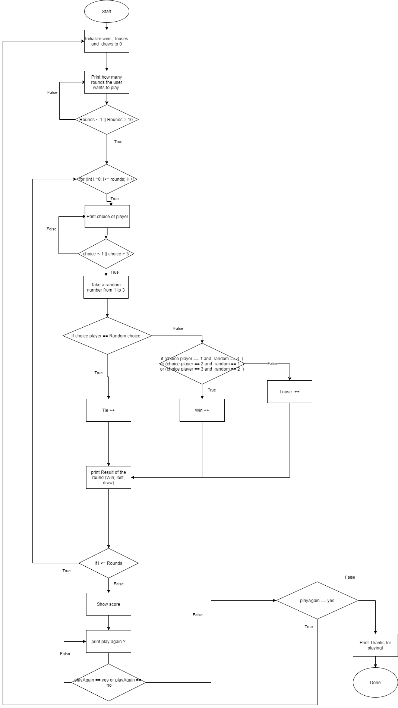

#About The Project 

The project is the First assignement of the course MThree JavaBasic.

The project one package com.M3Academy that contain 4 java classes, each one of the classes is an answer for the assignement.

1. RockPaperScisors
2. DogGenetics
3. HealthyHearts
4. SummativeSums

<!-- Flow Charts -->
## Flow Charts 

The folder charts contain the charts of each classe.

-   Flowchart of `RockPaperScisors.java`  :

-   Flowchart of `DogGenetics.Java` :

-   Flowchart of `HealthyHearts.java` :

-   Flowchart of `SummativeSums.java` :

